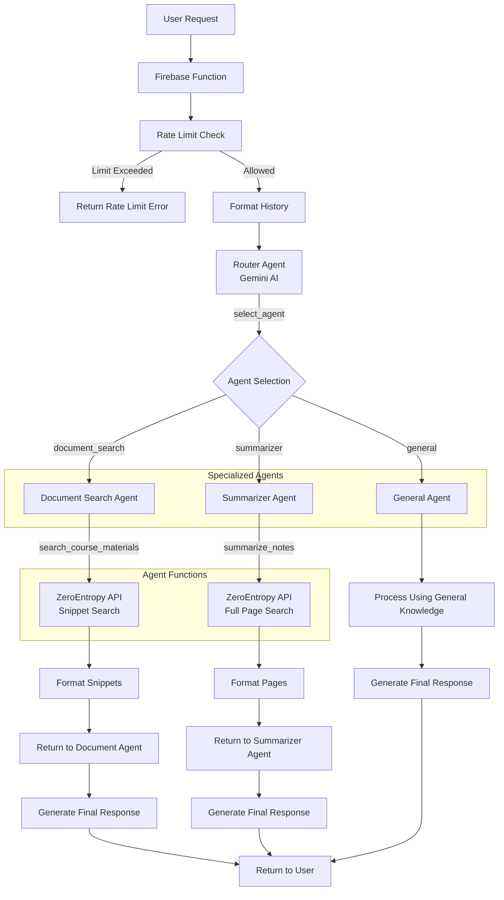

# Chiara Agent System Architecture

## Overview

This diagram shows how the Chiara chatbot system processes user requests using a router-agent architecture. The system uses Google's Gemini AI models with function-calling capabilities and integrates with ZeroEntropy for document search and retrieval.

## Components

1. **Firebase Function**: Entry point that receives user requests
2. **Rate Limit Check**: Verifies user hasn't exceeded their quota
3. **Router Agent**: Classifies request and selects appropriate specialized agent
4. **Specialized Agents**:
   - **Document Search Agent**: Answers specific questions using relevant document snippets
   - **Summarizer Agent**: Creates summaries of document content on a topic
   - **General Agent**: Handles general questions without document access

## Function Calling

- **Router**: Uses `select_agent` to determine which specialized agent to use
- **Document Search**: Uses `search_course_materials` to find relevant snippets
- **Summarizer**: Uses `summarize_notes` to retrieve and summarize full pages

## Document Retrieval

ZeroEntropy API is used for both:

- Retrieving snippets for document search
- Retrieving full pages for summarization

Each agent has custom system instructions and is configured with specific temperature and maximum token settings appropriate for its task.
